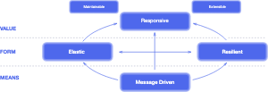

# java-k8s
Build and Deploy Optimized App.

## Reactive for better resource utilization
* Why Reactive?
  * Non-Blocking
    * Non-blocking communication allows recipients to only consume resources while active, leading to less system overhead.
  * Message Driven
  * ~~Funny Money~~
    * We can do more with same resources.
* Project Reactor
  * Servlet --> Webflux
  * Tomcat --> Netty
  * JDBC --> R2DBC
  

## Demo the project.
* Develop Locally
  * Explain application functionality
  * Show readiness and liveliness
    * Application knows when it is not working correctly
  * Show Stream 
  * Show Triggering of app down, and graceful exit
    
## Buildpacks
  * Paketo
    
## Deploy and maintain.
  * Deploy 
  * Config
  * Run
  * Repeat of the functionality and app behavior
  
## Road Ahead - Serverless
* Serverless (Lambda/Cloud Functions)
  * managed by cloud providers (startup/shutdown)
  * Billed by milli-secs
* Problem with Java in Serverless
  * Build time vs Run time 
  * Memory Footprint
  * Dependency Injection, class loader, proxies
* How to Lower these ^^?
  * Scripting Language Frameworks
    * Serverless framework (Demo if time permits.)
  * Rethink JVM/Native image
    * Demo of running in GraalVM (Demo if time permits)
  * Rethink Framework
    * Micronaut
  
## Q&A
